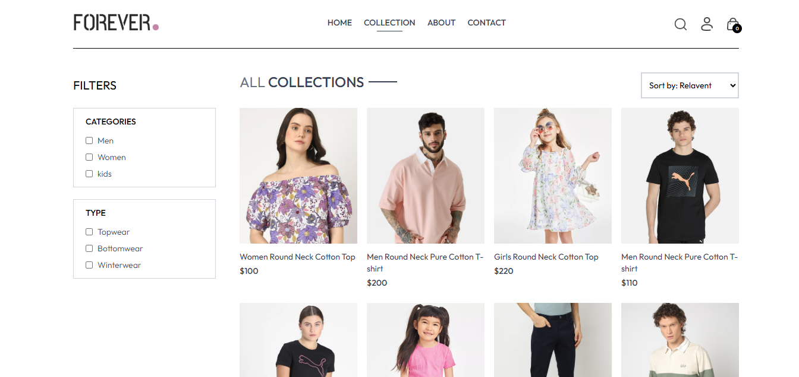

# Forever

# 🛒 E-Commerce Website  

An elegant and fully responsive e-commerce web application built using **React** and **Tailwind CSS**.  
The app comes with modern UI, powerful filtering options, and smooth user experience.  

---

### 🏠 Home Page  

### 🛍️ Collection Page  

## 🚀 Features  

- 🔍 **Search Products** – Quickly find items with an integrated search bar.  
- 🏷️ **Category & Price Filter** – Filter products based on category, price, and more.  
- 📱 **Responsive Design** – Works seamlessly across desktop, tablet, and mobile.  
- 🛒 **Add to Cart** – Smooth cart management system.  
- ⚡ **Fast & Optimized** – Built with React components and Tailwind utility classes. 
- 💵 **Stripe Payment Integration** – Fast and secure checkout using Stripe’s payment API.

---

## 🛠️ Tech Stack  

- **React.js** – Frontend library for building UI  
- **Tailwind CSS** – Utility-first CSS framework for styling  
- **JavaScript (ES6+)** – Core programming language  
- **React Router (optional)** – For navigation between pages  

---

 

---

